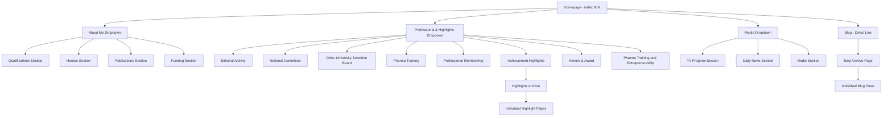

# Website Template Structure

## File Organization
```
project-root/
├── assets/
│   ├── css/
│   │   └── style.css (extracted from v3.html)
│   └── js/
│       └── main.js (extracted + enhanced menu functionality)
├── index.html (homepage from v3.html)
├── about.html
├── professional.html
├── highlights-archive.html
├── highlight-single.html
├── media.html
├── blog-archive.html
└── blog-single.html
```

## Navigation Structure



## Key Design Principles
1. **Strict Design Preservation**: All components from v3.html remain unchanged
2. **Component Reuse**: Cards, headers, footers, and navigation patterns from v3.html
3. **Responsive Behavior**: Maintaining exact responsive behavior from v3.html
4. **Professional Content**: Using realistic sample content throughout
5. **Enhanced UX**: Click-to-open menus with click-elsewhere-to-close functionality
6. **Rich Single Pages**: Sidebar and social sharing on blog/highlight single pages